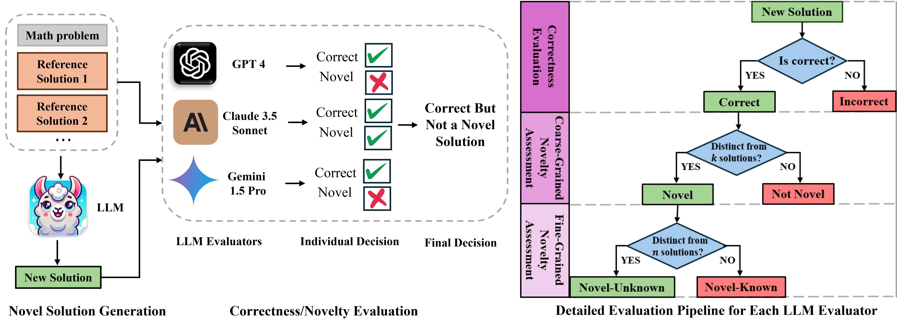

<p align="center">
     
</p>

# Assessing the Creativity of LLMs in Proposing Novel Solutions to Mathematical Problems

[](https://arxiv.org/abs/2410.18336) [[poster](./assets/CreativeMath_poster.pdf)] [[slides](./assets/CreativeMath_slides.pdf)]



## News
- [2025/03] CreativeMath was orally presented at AAAI-25 Conference (4.6%).
- [2025/01] **Dataset Reformatted**: The dataset has been restructured to improve usability. **Code Rewritten**: The source code has been refactored for better readability, and maintainability.
- [2024/12] 🔥 **Our CreativeMath paper is accepted by [AAAI 2025](https://aaai.org/conference/aaai/aaai-25/)** (23.4% acceptance rate).

## TL;DR
Evaluating the creative problem-solving capabilities of Large Language Models in mathematical reasoning.

## Abstract
The mathematical capabilities of AI systems are complex and multifaceted. Most existing research has predominantly focused on the **correctness** of AI-generated solutions to mathematical problems. In this work, we argue that beyond producing correct answers, AI systems should also be capable of, or assist humans in, developing **novel solutions** to mathematical challenges. This study explores the creative potential of Large Language Models (LLMs) in mathematical reasoning, an aspect that has received limited attention in prior research. We introduce a novel framework and benchmark, **CreativeMath**, which encompasses problems ranging from middle school curricula to Olympic-level competitions, designed to assess LLMs' ability to propose innovative solutions after some known solutions have been provided. Our experiments demonstrate that, while LLMs perform well on standard mathematical tasks, their capacity for creative problem-solving varies considerably. Notably, the Gemini-1.5-Pro model outperformed other LLMs in generating novel solutions. This research opens a new frontier in evaluating AI creativity, shedding light on both the strengths and limitations of LLMs in fostering mathematical innovation, and setting the stage for future developments in AI-assisted mathematical discovery.

## Installation
Follow these steps to install the required dependencies.
1. Clone the repository to your local machine:
```bash
git clone https://github.com/JunyiYe/CreativeMath.git
cd CreativeMath
```

2. Install the required Python packages using pip:
```bash
pip install -r requirements.txt
```

3. Set up your API keys for models via API calls in the `config.json`.

## Quick Start

### Novel Solution Generation
To generate novel solutions for CreativeMath datset, use the following command:
```bash
python src/generation.py --model_name gpt-4o
```
Replace gpt-4o with the desired model name as needed. The supported models can be found in the `config.json`. The generated solutions will be saved in the `output/generation` directory.

### Evaluation

**Note:**

- Before evaluating solutions, ensure that all **transition sentences** and **justifications** explaining the uniqueness of new solutions are **removed**. 
- These sentences, often located at the beginning or ending of a response, may influence evaluator judgment and should be excluded.

To evaluate a model, use the following command:
```bash
python src/evaluation.py --model_to_evaluate gpt-4o
```
Replace gpt-4o with the name of the model you want to evaluate. The evaluation results will be saved in the `output/evaluation` directory.


## Citation
If you find this project is helpful to your research, please consider to cite our paper:
```
@article{ye2024assessing,
  title={Assessing the Creativity of LLMs in Proposing Novel Solutions to Mathematical Problems},
  author={Ye, Junyi and Gu, Jingyi and Zhao, Xinyun and Yin, Wenpeng and Wang, Guiling},
  journal={arXiv preprint arXiv:2410.18336},
  year={2024}
}
```
